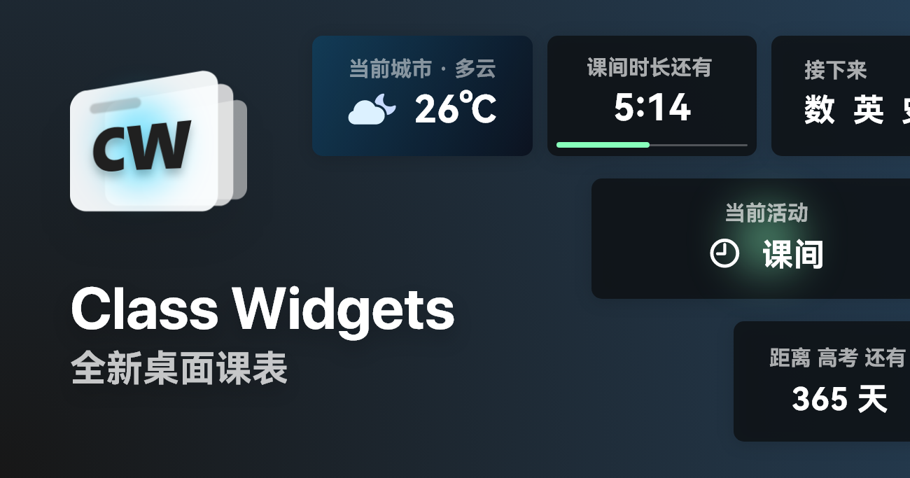
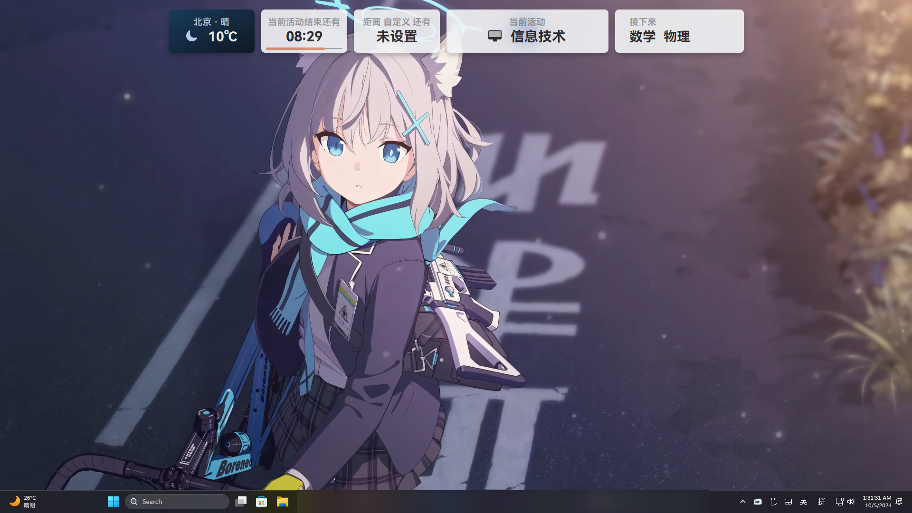
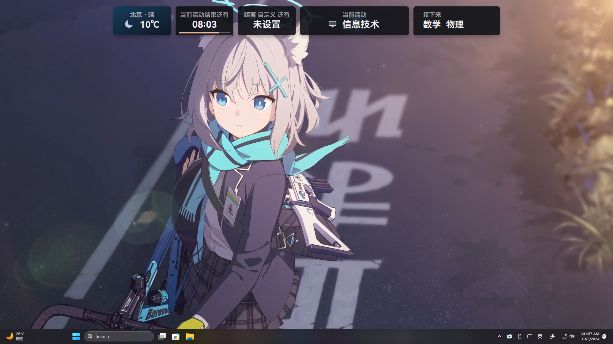

> [!CAUTION]

简体中文 | <a href="/docs/readme/README.en_US.md">English</a> | <a href="/docs/readme/README.ja.md">日本語</a>

  

  <h1 align="center">
  LiumingClassroom 1
</h1>

 全新桌面课表

>)

## 特性

- 由 Python 编写的**插件**系统和插件广场（详见最新构建）
- 将今日的课程安排以**小组件**的样式为你呈现；
- 具有 [上下课提醒](https://www.yuque.com/rinlit/liumingclassroom_help/fv2ou1i1ngap0hrl) 和预备铃，支持通过TTS进行提醒；
- 拥有主题系统支持你高度自定义。
- 简洁直观的 [课程表编辑](https://www.yuque.com/rinlit/liumingclassroom_help/oozelh8r56tmw0xb) 界面；
- 同时存储多个课程表文件，并能在各个 LiumingClassroom 导入和导出；
- 支持 [**通用课程表交换格式**（CSES）](https://github.com/SmartTeachCN/CSES) ，能在不同格式间转换；
- 提供快捷的调休、换课 [应对方案](https://www.yuque.com/rinlit/liumingclassroom_help/gc4epffu7g5bf9os)。
- 提供“天气”、“自定义倒计时”等实用小组件；
- 通过 [“自定义”](https://www.yuque.com/rinlit/liumingclassroom_help/qyly70ht1ogge1pi) 个性化你的 LiumingClassroom；
- 具有亮/暗色主题，还能根据系统设置自动切换； ……

## 软件截图

#### 主界面(亮色)

#### 主界面(暗色)

## 安装&使用

> [!TIP]
> 可在 [LiumingClassroom 官方文档](https://www.yuque.com/rinlit/liumingclassroom_help/gs3gsbms1iivgibm) 查看教程。

> [!IMPORTANT]
> 若要体验此页面的特性，请前往 [**Actions**](https://github.com/rankfrank4010/liumingclassroom/actions) 页面下载最新构建。

下载  中最新版的压缩文件，解压到合适位置后，运行 `LiumingClassroom.exe` 即可。
可通过托盘菜单进入设置、或退出此程序。

## 协议

此项目 (LiumingClassroom) 基于 GPL-3.0 许可证授权发布，详情请参阅 [LICENSE](./LICENSE) 文件。

Copyright © 2025 LiumingClassroom.

